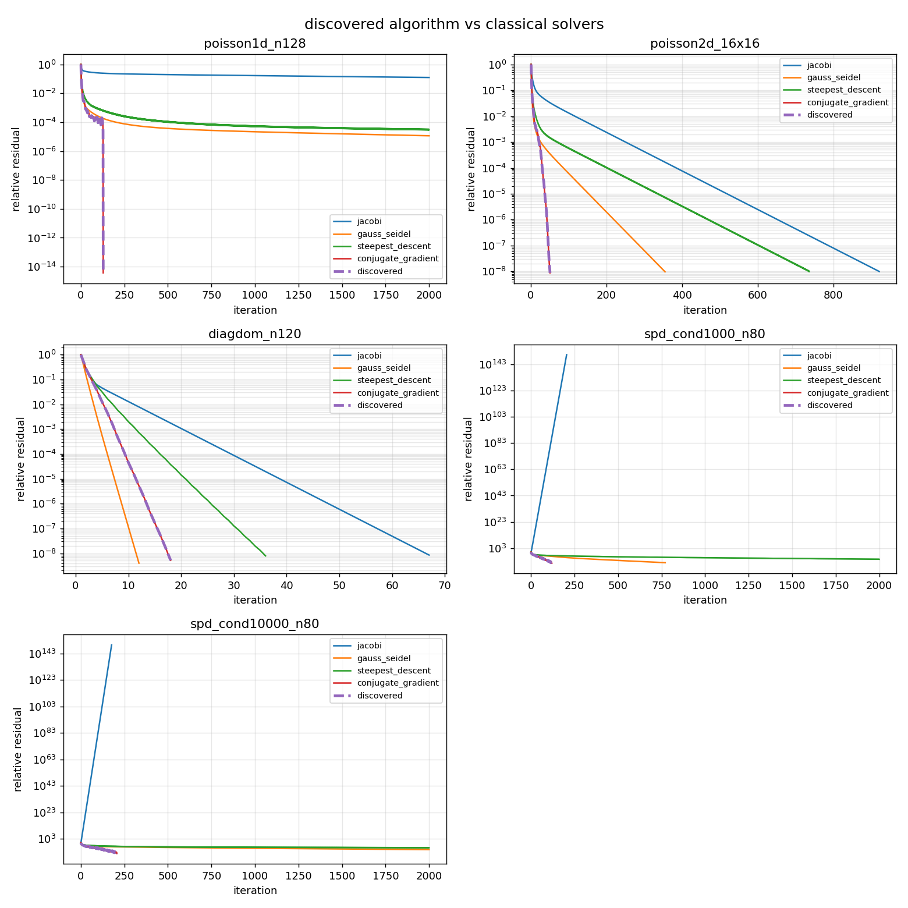

# automated discovery of iterative linear solver algorithms



*the dashed line is an algorithm the computer invented on its own. it lands
exactly on conjugate gradient, a method humans took decades to develop, while the
older baselines stall out.*

the question behind this project: given a class of math problems, can a search
process actually invent a numerical algorithm that holds up against the ones
humans designed, and can we understand what it comes up with?

instead of hand writing a solver, i defined a small "language" for iterative
linear solvers and let an evolutionary search plus some local refinement build
update rules out of primitive operations. every candidate is scored by how fast
it solves a suite of benchmark systems a x = b.

this is meta research. the system designs algorithms rather than just applying
them, in the same spirit as deepmind's alphatensor and alphadev, but shrunk down
to something transparent and fully reproducible on a laptop.

## the idea in one picture

every candidate algorithm is a two term recurrence:

```
d_k     = r_k + beta_k * p_(k-1)        # search direction, r_k = b - a x_k
x_(k+1) = x_k + alpha_k * d_k           # update
p_k     = d_k
```

the scalars alpha_k and beta_k are not fixed. each one is an evolvable
expression:

```
coeff = scale * feature[num] / feature[den]
```

built from inner product features that get recomputed every iteration (things
like r·r, r·ad, d·ad, ad·ad, the previous r·r, and so on). that one template is
expressive enough to contain a lot of classical methods as special cases:

```
richardson           beta = 0                 alpha = constant
steepest descent     beta = 0                 alpha = (r·r)/(r·ar)
conjugate gradient   beta = (r·r)/(r·r)_prev  alpha = (r·r)/(d·ad)
orthomin(1)          beta = 0                 alpha = (r·ad)/(ad·ad)
heavy ball momentum  beta = constant          alpha = constant
```

so the search is free to rediscover any of those, blend them, or find something
that isn't in the table.

## how the search works

1. represent algorithms as genomes, one beta coefficient and one alpha
   coefficient (src/genome.py).
2. evaluate each genome by running it as a solver on a training suite and
   averaging the iterations to converge, with a heavy penalty for anything it
   fails or diverges on (score in src/evolve.py).
3. search with an evolutionary algorithm: tournament selection, crossover,
   mutation, elitism, and fresh random immigrants for diversity.
4. refine promising genomes with a memetic local search. it does coordinate
   descent on the coefficient scales after every structural change, plus a joint
   scale grid so coupled optima are reachable. this is the part that lets the
   search land on exact classical forms.
5. benchmark the winner on a held out test suite against the right human
   baselines (src/benchmark.py, src/experiments.py).

## the four experiments

`python src/experiments.py` runs the spd, single direction nonsymmetric, and
preconditioner experiments and writes results/experiments_summary.txt. the multi
direction experiment is heavier and lives in its own runner,
`python src/orthomin.py`, which writes results/orthomin.log.

### a. spd systems: does it rediscover conjugate gradient?

yes, exactly. starting from random primitives the search lands on

```
beta_k  = (r·r) / (r·r)_prev      # fletcher reeves beta
alpha_k = (r·r) / (d·ad)          # cg's step length
```

and on the five held out spd problems it matches conjugate gradient iteration
for iteration (129, 51, 18, 120, 207). this is the sanity check: the space and
the search are sound, they recover a strong human algorithm without being told
about it.

### b. nonsymmetric systems: can it find something good where the answer is open?

this is the real test. for nonsymmetric a there is no single best short
recurrence method, so a discovered winner would be a genuine result. the search
trains on a narrow slice (convection diffusion at moderate strength plus one
diagonally dominant case) and is tested on bigger grids, stronger convection,
and an unseen recirculating family. we run five independent seeds.

the fair cost metric here is matrix vector products, not iterations, because
bicgstab does two per step while gmres, orthomin and the discovered method do
one. the honest findings:

* the discovered short recurrence solver beats orthomin(1), its fair same memory
  baseline, on about 65 percent of held out cases, and by a wide margin on
  convection diffusion.
* it is competitive with bicgstab on convection diffusion but does not beat
  gmres(30) or bicgstab in general.
* it generalises poorly to the strongly skew recirculating family it never saw.

so with a single stored direction it is a real but modest result: the search
finds an orthomin(2) class method that beats the classical short recurrence
baseline but not the strong methods, and it does not generalise to the skew
family. experiment d fixes this by giving the search more memory.

### c. multi direction search (gcr / orthomin-m)

the two term recurrence keeps one previous direction. here we let the search keep
a window of the last m directions and orthogonalise the new direction against all
of them, exactly the generalized conjugate residual (gcr) / orthomin(m) family.
this still costs one matrix vector product per step, because the images a p_j are
stored and reused, so a d is assembled without a new matvec. see src/orthomin.py.

given this richer template the search rediscovers gcr from primitives:

```
beta_j = -(a r . a p_j) / (a p_j . a p_j)     alpha = (r . a d) / (a d . a d)
```

(the search finds scale about minus one on beta and one on alpha, which is gcr.)

with a few stored directions this is much stronger, and it uses one matvec per
step against bicgstab's two:

* it fixes the generalisation failure. on the unseen recirculating family the one
  direction method needed 334 matvecs; the multi direction method needs about 30,
  matching gmres.
* it beats bicgstab in matvecs on the diagonally dominant family and is
  competitive with it on convection diffusion.
* it ties gmres(30) on several problems while keeping only a handful of vectors
  instead of thirty.

this is the honest headline: given a template rich enough to express short memory
krylov methods, the search recovers gcr and lands in the same performance class
as the strong human baselines, beating bicgstab on some families at half the
matvec cost. it is competitive with the state of the art on this benchmark rather
than beaten by it. see results/orthomin.log.

### d. polynomial preconditioner discovery

here the solver is fixed to conjugate gradient and the search discovers a degree
three polynomial preconditioner m_inv = q(a). the discovered preconditioner cuts
cg iteration count by roughly half on every test problem (for example 44 down to
21 on a 2d poisson grid). the honest tradeoff: a degree three polynomial applies
a three extra times per step, so it costs more serial matrix vector products. it
wins on iterations, which is the cost that dominates on parallel and
communication bound hardware, and that is exactly why polynomial preconditioners
are used there.

## running it

```bash
pip install -r requirements.txt
python src/experiments.py            # spd, single direction nonsym, preconditioner
python src/orthomin.py               # multi direction (gcr / orthomin-m) discovery
python src/main.py                   # just the spd rediscovery, with a plot
python src/main.py --gens 25 --pop 60 --seed 3 --maxiter 150
```

outputs land in results/: convergence.png for the spd run, plus nonsym.log,
precond.log, orthomin.log and experiments_summary.txt.

each module also runs on its own for a quick check, for example
python src/baselines.py or python src/problems.py.

## tools and technologies

* python 3, plain and dependency light on purpose so the whole thing is easy to
  read and reproduce.
* numpy for the vector and matrix math.
* scipy.sparse for the sparse matrices, and scipy.sparse.linalg for the gmres and
  bicgstab baselines.
* matplotlib for the convergence plots.
* the search, the genome representation, the memetic refinement, the conjugate
  gradient and gcr baselines and all the interpreters are written from scratch,
  no external optimisation or genetic algorithm library.

install with `pip install -r requirements.txt`.

## inspiration

i kept reading about ai systems that discover algorithms instead of just running
them, and wanted to see if i could build a small honest version of that idea
myself. the two that started it:

* alphatensor, which found faster matrix multiplication algorithms
  (https://www.nature.com/articles/s41586-022-05172-4).
* alphadev, which found faster sorting routines
  (https://www.nature.com/articles/s41586-023-06004-9).

those use huge reinforcement learning systems. i wanted something transparent
that runs on a laptop and where you can actually read the algorithm it invents as
plain math, so i pointed the idea at iterative linear solvers, a corner of
numerical computing with clear strong human baselines (conjugate gradient, gmres,
bicgstab) to measure against.

## is this competition ready?

honest answer: the spd rediscovery validates the machine; the multi direction
experiment then recovers gcr and reaches the same performance class as the strong
human baselines, beating bicgstab on some families at half the matvec cost, which
is a real and defensible result reported without spin. it is not a brand new
algorithm that beats everything, gcr already exists, but showing that an
automated search recovers it and lands competitive with the state of the art
across families is a solid story.

what would make it clearly novel rather than a strong rediscovery: run the search
on real matrices from the suitesparse collection instead of synthetic families,
let it search over the memory size m as well, add a proper communication cost
model (where the preconditioner and the one matvec per step really pay off), and
look hard at whether any discovered variant with a non gcr beta wins on a specific
family. the apparatus for all of that is already here.

## file map

```
algorithm-discovery/
  README.md              this file
  requirements.txt
  results/               plots, logs, and the summary get written here
  src/
    problems.py          spd and nonsymmetric benchmark families, train/test split
    baselines.py         jacobi, gauss seidel, steepest descent, cg, gmres,
                         bicgstab, orthomin(1); iterations and matvecs
    genome.py            algorithm representation and interpreter
    evolve.py            evolutionary search, fitness, memetic refinement
    benchmark.py         spd comparison table, convergence plots, summary
    experiments.py       spd, single direction nonsym, preconditioner + report
    orthomin.py          multi direction (gcr / orthomin-m) genome and search
    preconditioner.py    polynomial preconditioner discovery
    main.py              spd rediscovery driver
```
